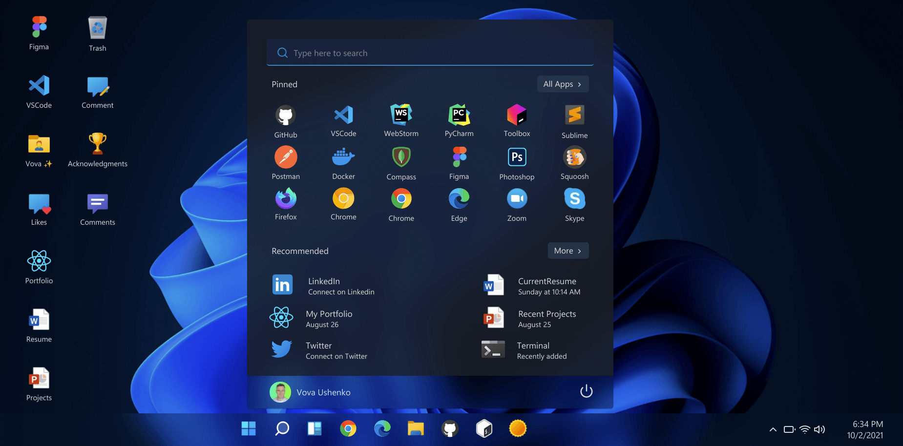
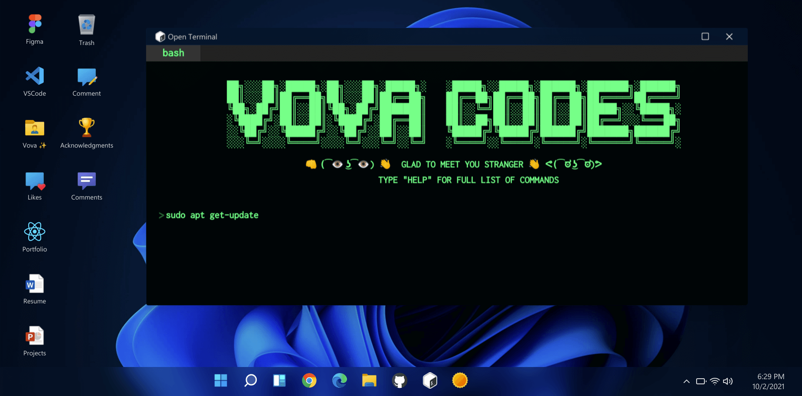
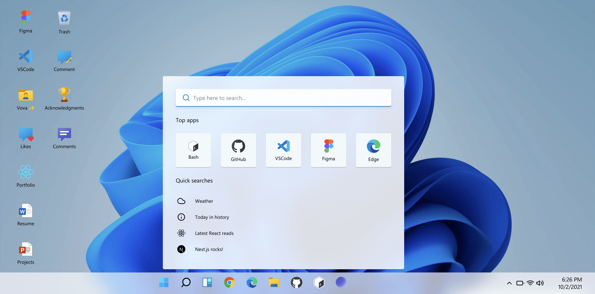
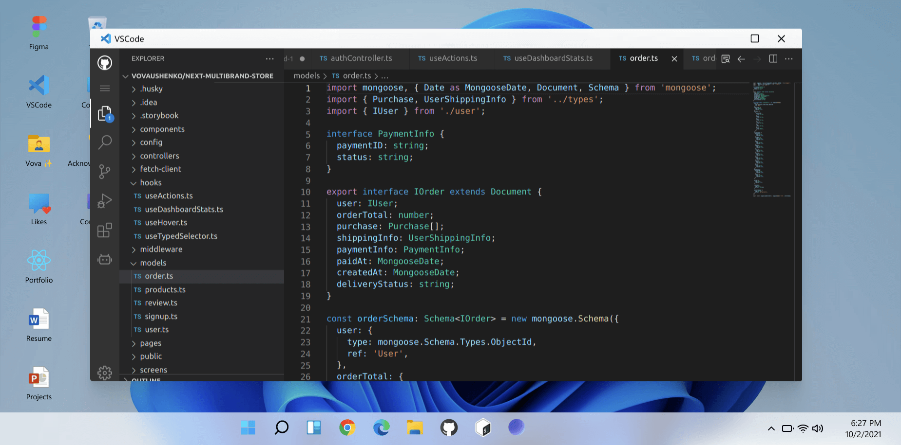

# ✨ Vovacodes | Portfolio ✨

](https://github.com/vovaushenko)
](https://twitter.com/vova_ush)
](https://github.com/vovaushenko)
](https://reactjs.org/)

#### Try it online: [https://www.vovacodes.ca/](https://https://www.vovacodes.ca/)

# At glance

# Stack

- Next.js 🚀
- React ⚛
- Redux 🔥
- Styled-components 💅
- MongoDB 🍃
